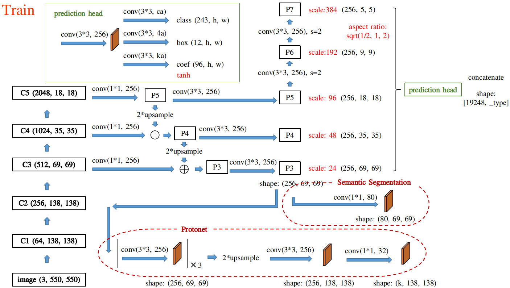

# Instance-Segmentation-using-YOLACT
```
    ██╗   ██╗ ██████╗ ██╗      █████╗  ██████╗████████╗
    ╚██╗ ██╔╝██╔═══██╗██║     ██╔══██╗██╔════╝╚══██╔══╝
     ╚████╔╝ ██║   ██║██║     ███████║██║        ██║   
      ╚██╔╝  ██║   ██║██║     ██╔══██║██║        ██║   
       ██║   ╚██████╔╝███████╗██║  ██║╚██████╗   ██║   
       ╚═╝    ╚═════╝ ╚══════╝╚═╝  ╚═╝ ╚═════╝   ╚═╝ 
```

This is implementation of the paper [Yolact:《YOLACT: Real-time Instance Segmentation》](https://arxiv.org/abs/1904.02689).

The vision community has rapidly improved object detection and semantic segmentation results over a short period of time. In large part, these advances have been driven by powerful baseline systems, such as the Fast/Faster RCNN and Fully Convolutional Network (FCN) frameworks for object detection and semantic segmentation, respectively. For Instance Segmentation , State-ofthe-art approaches like Mask RCNN and FCIS directly build off of advances in object detection like Faster R-CNN and R-FCN . Yet, these methods focus primarily on performance over speed, leaving the scene devoid of instance segmentation parallels to real-time object detectors like SSD and YOLO. YOLACT fill that gap with a fast, one-stage instance segmentation model in the same way that SSD and YOLO fill that gap for object detection.

### The network structure.  


The original model used Resnet-101 as backbone and was trained on MS-COCO Dataset of 80 classes. But due to GPU limitations, I have trained my model using PASCAL VOC dataset which contains 3000 images of 20 classes. As my model was predicting 20 classes instead of 80, I used Resnet-50 as backbone to compensate. After training for 100 epochs on Tesla K80 GPU it managed to achieve fairly good results.

#### Some examples from our YOLACT base model


You can download the Pascal VOC dataset [here](http://host.robots.ox.ac.uk/pascal/VOC/voc2012/index.html) or using this [link](http://host.robots.ox.ac.uk/pascal/VOC/voc2012/VOCtrainval_11-May-2012.tar)

Feel free to download my trained weights using [this]() drive link.

